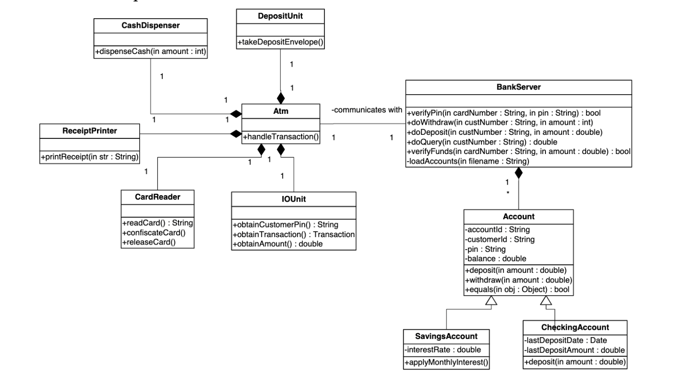

# ATM_Project_Java
The following project represents basic functioning of an ATM

The class diagram: 

Reference:
https://github.com/rydgeli/CMU-95713-Intermediate-Java/blob/master/HW3/95713_HW3_F15.pdf
